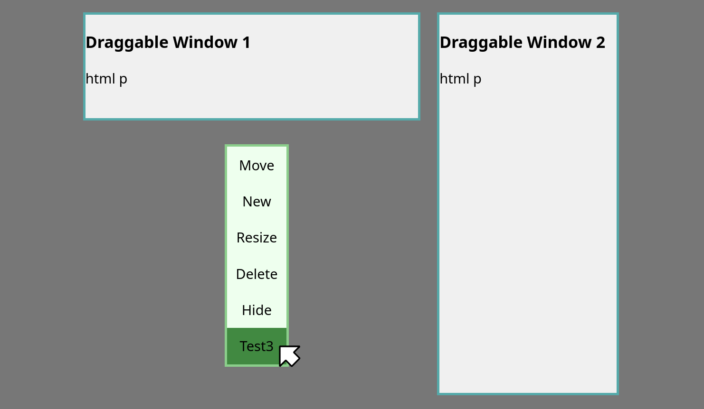

# riwo
small webassembly rio-like window manager in go

riwo stands for "Riwo is web one"

hardly inspired by Plan 9's [Rio](https://9p.io/wiki/plan9/using_rio/index.html)

## How it works

It uses [syscall/js](https://pkg.go.dev/syscall/js) to manipulate DOM and mimic rio

Windows are \<div\>s with html inside

Try it here: [deployment](https://ninefid.uk.to/riwo)

## Roadmap
### Actions
- [x] New
- [x] Resize
- [x] Move
- [x] Delete
- [x] Hide
### FS (its probably a good idea to make a RO fs and some mountpoint for sandboxing)
- [ ] File system structure
- [ ] Static files(?)
- [ ] Dynamic files(?) (creatable/deletable)
- [ ] map objects to fs (/proc?)
### Basic apps
- [ ] rc-like shell
- [ ] shell builtins
- [ ] coreutils
- [ ] acme-like text editor/viewer
### Accessibility
- [x] Touch adaptation

## Possible known issues

There may be some inefficient eventListeners (tho i removed per-window ones)

Menu opens with single RMB click and NOT hold because I found it simpler

SVG cursors may be junky

Testing needed
