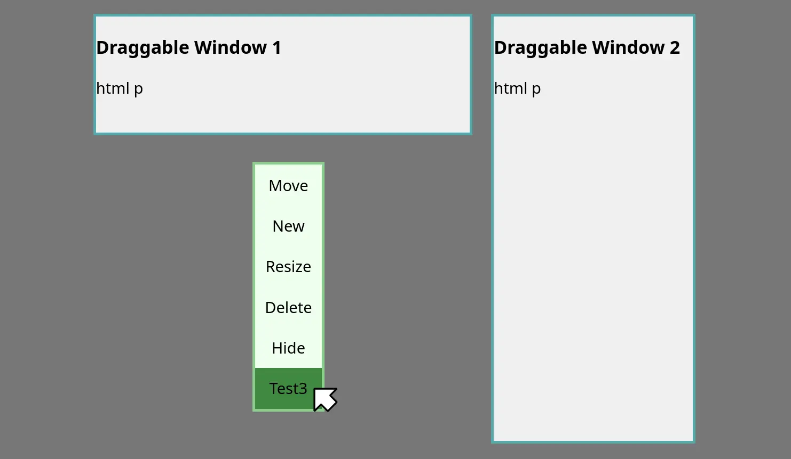

# riwo

Small webassembly rio-like window manager in go

riwo stands for "Riwo is web one"

hardly inspired by Plan 9's [Rio](https://9p.io/wiki/plan9/using_rio/index.html)



## How it works

It uses [syscall/js](https://pkg.go.dev/syscall/js) to manipulate DOM and mimic rio

Windows are \<div\>s with html inside

Credits to Go team for their [Go fonts](https://go.dev/blog/go-fonts)

Try it here: [deployment](https://ninefid.uk.to/riwo)

I would like to see any contribution

## Roadmap
### Actions
- [x] New
- [x] Resize
- [x] Move
- [x] Delete
- [x] Hide
- [x] Window-specific context menu entries
- [x] Bearable apps
- [x] Make apps load as modules, not monolithic wasm
### Accessibility
- [x] Touch adaptation
### Default apps
- [x] Starter (`Default`)
- [x] Clock (`ZClock`)
- [x] Audio player (`DPlayer`)
- [x] Mahjongg (`Mahjongg`)
- [x] Monaco Editor (`Monaco`)
- [x] Manual (`RTFM`)
- [ ] Gallery (`?`)
- [ ] Drawterm (`?`)
- [ ] Doom (`Doom`?)
- [ ] Deus Ex Demo (`DXdemo`?)
- [ ] BoxedWine (`?`)

## Possible known issues

Menu opens with single RMB click and NOT hold because I found it simpler

Buttons can be clicked with both RMB and LMB and NOT mousewheel button because I found it simpler

If mode was interrupted without mouseup things may brake (I really dont want to fix this)

Mahjongg has no plan9-ish cursor for cursor "not allowed"

Monaco opens 2 context menus: Riwo's one and own one. There is nothing I can think of I can do with that.

<a href="https://star-history.com/#den0620/riwo&Date">
    <picture>
        <source media="(prefers-color-scheme: dark)" srcset="https://api.star-history.com/svg?repos=den0620/riwo&type=Date&theme=dark" />
        <source media="(prefers-color-scheme: light)" srcset="https://api.star-history.com/svg?repos=den0620/riwo&type=Date" />
        
    </picture>
</a>

## Building

```shell
# Default build (outputs to build/wm.wasm + build/<guest>.wasm)
make default

# Tiny (tinygo) build
make tiny

# Remove build artifacts
make clean
```

## Documentation

Architecture and contributor-facing detail live in [DOCS.md](DOCS.md). It covers:

- **Layout** - `entry/wm`, `entry/guest/<name>/`, `wm/`, `apps/`, `assets/kernel.js`, `tools/guestgen`
- **Guest runtimes** - Go wasm, **`js-mount`** (Monaco), and experimental **`wasm-raw`**, driven by **`guest.manifest.json`** and **`assets/generated-manifest.js`**
- **`__riwoKernel`** - spawn queue, bootstrap handoff, guest context menus
- **Build & dev** - `make` targets, guestgen stamp
- **Adding a guest** - step-by-step for Go wasm and js-mount apps
- **App notes** - DPlayer tag parsing (`audiometa/`), ZClock UTC offset, known limitations
